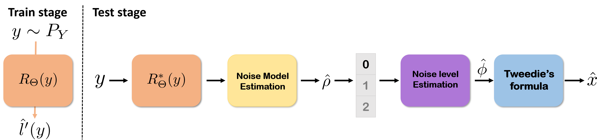

# Noise Distribution Adaptive Self-Supervised Image Denoising using Tweedie Distribution and Score Matching

This repository is the official implementation of Noise Distribution Adaptive Self-Supervised Image Denoising using Tweedie Distribution and Score Matching.


## Requirements

To install requirements:

```setup
conda env create -f requirements.yml
conda activate requirements
```

>📋  If you install anaconda package, it is possible to meet the prerequirements by running abobe code.

## Data
We generated synthetic noise images for each noise distribution. The trainset was set to DIVK2 and CBSD400. 
We provided the generation sourcecode "Datageneration.ipynb"


## Training

To train the model(s) in the paper for additive Gaussian noise, run this command:

```train
python train.py --model Gaussian  --dataroot /your_path/ --dataroot_valid /your_path/ --name CBSD_ours_unet_gau --gpu_ids '0' --direction BtoA 
```
To train the model(s) in the paper for Poisson noise, run this command:

```train
#python train.py --model Poisson -  --dataroot /your_path/ --dataroot_valid /your_path/  --name CBSD_ours_unet_poi --gpu_ids '0' --direction BtoA 
```

To train the model(s) in the paper for Gamma noise, run this command:

```train
#python train.py --model Gamma   --dataroot /your_path/ --dataroot_valid /your_path/  --name CBSD_ours_unet_gamma --gpu_ids '0' --direction BtoA 
```

>📋  Dataroot "your_path" depends on the your data path.

## Evaluation

To evaluate my model on test dataset for the Gaussian case, run:

```eval
#python test.py --model Gaussian  --dataset_mode test2  --noise_level 25 or 50 -dataroot /your_path/ --name CBSD_ours_unet_gau --model Gaussian --direction BtoA  --gpu_ids '0' --epoch best --results_dir /your_results/
```

To evaluate my model on test dataset for the Poisson case, run:

```eval
#python test.py --model Poisson  --dataset_mode test2  --noise_level 001 or 005 --dataroot /your_path/  --name CBSD_ours_unet_poi --model Poisson --direction BtoA  --gpu_ids '0' --epoch best --results_dir /your_results/
```

To evaluate my model on test dataset for the Gamma case, run:
```eval
python test.py --model Gamma  --dataset_mode test2 --dataroot /your_path/ --name CBSD_ours_unet_gamma --model Gamma --direction BtoA  --gpu_ids '0' --epoch best --results_dir /your_results/ --noise_level g_100 or g_50

```

>📋  Dataroot "your_path" depends on the your data path for test dataset such as CBSD68, Kodak. Change "--result_dir" to save results of image on your device. Specify your option to "noise level" 

## Pre-trained Models

You can download pretrained models [here](https://drive.google.com/drive/folders/15ap9SGq7WtXkRny9doGXfWaPdYGXppn3?usp=sharing) 

To brifely evaluate the proposed method given pretrained weight, we provided the Kodak Dataset for gaussian noisy and target pairs. 

Firrst, put in pretrained weights into checkpoints folder.

In case of Non-blind noise:

run:
```
python test.py --model Gaussian  --dataset_mode test2  --noise_level 25  -dataroot_valid /test_images/ --name CBSD_ours_unet_gau_blind --model Gaussian --direction BtoA  --gpu_ids '0' --epoch best --results_dir /your_results/
```

## Qualitative Results


